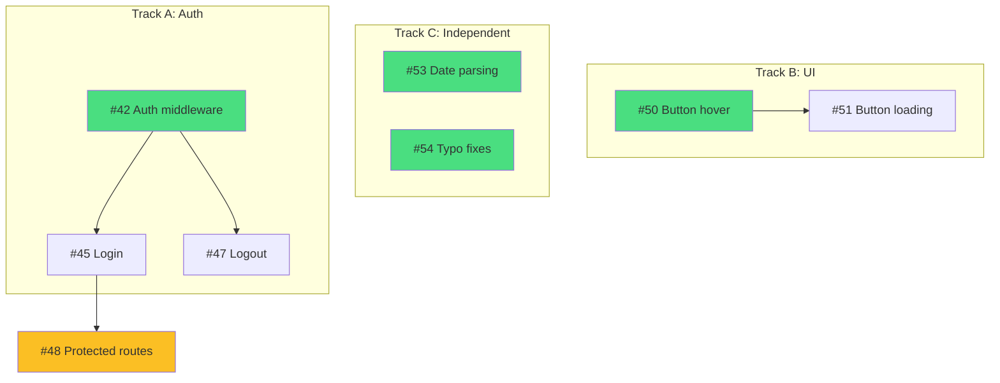

# Chart Dependencies

Display a visual dependency graph based on the most recent `/ke:map` analysis in this conversation.

## Usage

```
/ke:chart [--mermaid]
```

- **Default:** Output ASCII art diagram for terminal display
- **With `--mermaid`:** Output Mermaid diagram for markdown rendering

## Instructions

### Step 1: Check for Map Context

Look for a previous `/ke:map` execution in this conversation. You need:
- The dependency graph (which issues depend on which)
- The track assignments (Track A, Track B, etc.)
- Issue titles and blocked status

**If no `/ke:map` context exists:**
```
No dependency map found. Run /ke:map first to analyze issues and detect dependencies.
```

### Step 2: Parse Arguments

Check if `--mermaid` flag is present.

### Step 3: Output the Graph

#### Default (ASCII)

Output an ASCII diagram for terminal display:

```
Track A (Auth)          Track B (UI)         Track C (Independent)
─────────────           ────────────         ─────────────────────
     │                       │                    │         │
     ▼                       ▼                    ▼         ▼
  ┌──────┐               ┌──────┐             ┌──────┐  ┌──────┐
  │ #42  │               │ #50  │             │ #53  │  │ #54  │
  └──┬───┘               └──┬───┘             └──────┘  └──────┘
   ┌─┴─┐                    │
   ▼   ▼                    ▼
┌────┐┌────┐             ┌──────┐
│#45 ││#47 │             │ #51  │
└─┬──┘└────┘             └──────┘
  │
  ▼ (blocked)
┌──────┐
│ #48  │
└──────┘
```

**ASCII conventions:**
- Box drawing characters: `┌`, `┐`, `└`, `┘`, `│`, `─`, `┬`, `┴`, `├`, `┤`
- Arrows: `▼` for downward flow
- Mark blocked issues with `(blocked)` annotation
- Arrange tracks side by side horizontally
- Show dependencies as vertical connections within tracks
- Show cross-track dependencies with notation if needed

#### With `--mermaid`

Output a Mermaid flowchart:

~~~markdown
## Dependency Graph



**Legend:**
- Green = Ready to start
- Yellow = Blocked
- Arrows = "must complete before"
~~~

**Mermaid conventions:**
- Use `flowchart TD` (top-down direction)
- Group issues by track using `subgraph` blocks
- Style ready issues with green (`#4ade80`)
- Style blocked issues with yellow (`#fbbf24`)
- Show dependencies as arrows between nodes

### Important

- This command only visualizes data from a previous `/ke:map` run
- It does NOT fetch new data from GitHub
- It does NOT detect or add new dependencies
- If the user wants fresh data, tell them to run `/ke:map` again
