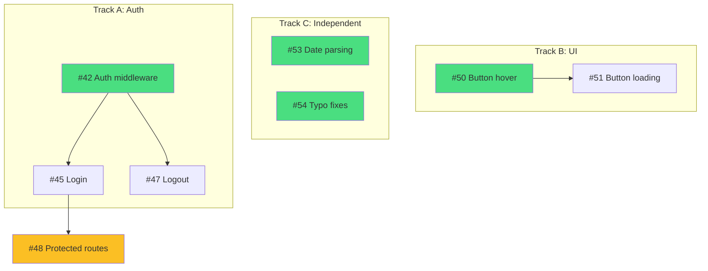

# Map Issues

Analyze all open issues to detect dependencies, determine optimal execution order, and output a plan with parallel tracks.

## Usage

```
/ke:map [issue-numbers] [--milestone <name>] [--label <label>]
```

- With no arguments, analyzes all open issues
- With issue numbers (e.g., `/ke:map 42 45 47`), analyzes only those issues
- Use `--milestone <name>` to filter to a specific milestone (e.g., `--milestone "Sprint 1"`)
- Use `--label <label>` to filter to specific labels (e.g., `--label bug`)
- Filters can be combined: `/ke:map --milestone "Sprint 1" --label bug`

## Instructions

You are tasked with analyzing open issues to detect dependencies, write them to GitHub, and output an execution plan.

### Step 1: Gather Issues

**Parse arguments:**
1. Extract `--milestone <name>` flag if present (value may be quoted, e.g., `"Sprint 1"`)
2. Extract `--label <label>` flag if present
3. Remaining arguments are treated as issue numbers

**If `--milestone` is provided** (e.g., `/ke:map --milestone "Sprint 1"`):
```bash
# Fetch all open issues in that milestone (optionally filtered by label)
gh issue list --state open --milestone "Sprint 1" [--label "bug"] --json number,title,body,labels,milestone --limit 100
```

**If specific issue numbers are provided** (e.g., `/ke:map 42 45 47`):
```bash
# Fetch each specified issue
gh issue view 42 --json number,title,body,labels,milestone
gh issue view 45 --json number,title,body,labels,milestone
gh issue view 47 --json number,title,body,labels,milestone
```

**If `--milestone` AND issue numbers are both provided** (e.g., `/ke:map 42 45 --milestone "Sprint 1"`):
- Fetch the specified issues
- Verify they belong to the specified milestone (warn if any do not)

**If no arguments or only `--label` provided**, fetch all open issues:
```bash
# All open issues (optionally filtered by label)
gh issue list --state open [--label "bug"] --json number,title,body,labels,milestone --limit 100
```

For each issue, also fetch comments to find implementation plans:
```bash
gh issue view <number> --comments
```

### Step 2: Extract Information from Each Issue

For each issue, extract:

1. **Explicit dependencies** - Look for `**Depends on:** #X` in body or comments
2. **Files to be modified** - From the "Files to Modify" section of implementation plans
3. **Complexity estimate** - Based on number of files and steps in plan
4. **Existing worktree status** - Check if already in progress (`git worktree list`)

Issues without implementation plans should be flagged as "unplanned."

### Step 3: Detect New Dependencies

Analyze for dependencies that aren't explicitly declared:

**File overlap detection:**
- If issue A and issue B both modify `src/auth/middleware.ts`, they likely depend on each other
- The one with fewer changes or simpler scope should go first
- Add dependency: the more complex one depends on the simpler one

**Component overlap detection:**
- Issues touching the same component/directory (e.g., both in `src/auth/`)
- May benefit from sequential work to establish patterns

**Merge risk assessment:**
- Issues touching many of the same files = high merge risk if parallel
- Prefer sequential execution for high-overlap pairs

**Criteria for NOT adding a dependency:**
- Issues touch completely different parts of the codebase
- File overlap is trivial (e.g., both add to a config file)
- One issue is clearly independent (e.g., documentation only)

### Step 4: Apply Dependencies to Issues

For each newly detected dependency, update the issue on GitHub:

```bash
gh issue comment <number> --body "**Depends on:** #<dependency-number>

_Detected by /ke:map: Both issues modify \`src/auth/middleware.ts\`. Sequential execution recommended to avoid merge conflicts._

---
*Generated by Claude Code*"
```

**Important:**
- Only add NEW dependencies (don't duplicate existing ones)
- Include a brief explanation of why the dependency was detected
- This creates a persistent record on GitHub that future runs will read

### Step 5: Build Dependency Graph

Create a directed graph where:
- Nodes = issues
- Edges = dependencies (A → B means "A must complete before B")

Identify:
- **Root nodes** - Issues with no dependencies (can start immediately)
- **Leaf nodes** - Issues that nothing depends on
- **Chains** - Linear sequences of dependencies
- **Parallel groups** - Issues that can run simultaneously

### Step 6: Group into Tracks

Organize issues into parallel tracks:

**Track assignment rules:**
1. Issues with file overlap go in the SAME track (sequential)
2. Independent issues go in DIFFERENT tracks (parallel)
3. Balance track sizes when possible
4. Minimize total tracks (aim for 2-4)

**Within each track, order by:**
1. Dependency order (dependencies first)
2. Complexity (simpler issues first to establish patterns)
3. Risk (lower risk first)

### Step 7: Output the Plan

Generate three sections:

#### Section 1: Dependency Updates Applied

```markdown
## Dependencies Applied

| Issue | New Dependency | Reason |
|-------|---------------|--------|
| #45 | Depends on #42 | Both modify src/auth/middleware.ts |
| #47 | Depends on #42 | Both modify src/auth/middleware.ts |
| #51 | Depends on #50 | Both modify src/components/Button.tsx |

3 dependencies added to issues.
```

If no new dependencies were found:
```markdown
## Dependencies

No new dependencies detected. Existing dependencies are up to date.
```

#### Section 2: Execution Plan

```markdown
## Execution Plan

Run these in separate terminals for parallel execution:

### Track A: Auth System
Issues with shared files in `src/auth/`

```bash
# Terminal 1
/ke:branchfix 42      # Add auth middleware
# After #42 merged to main:
/ke:branchfix 45      # Add login endpoint
/ke:branchfix 47      # Add logout endpoint
```

### Track B: UI Components
Issues with shared files in `src/components/`

```bash
# Terminal 2
/ke:branchfix 50      # Button hover states
# After #50 merged to main:
/ke:branchfix 51      # Button loading states
```

### Track C: Independent
No file overlap, can run anytime

```bash
# Terminal 3
/ke:branchfix 53 54   # Date parsing + typo fixes (batch - no overlap)
```

### Blocked
| Issue | Blocked By | Reason |
|-------|-----------|--------|
| #48 | #45 | Explicit dependency in issue |

### Unplanned (run /ke:plan first)
- #52: No implementation plan found
- #56: No implementation plan found
```

#### Section 3: Dependency Graph

Output a Mermaid diagram:

~~~markdown
## Dependency Graph



**Legend:**
- Green = Ready to start
- Yellow = Blocked
- Arrows = "must complete before"
~~~

Also output ASCII version for terminal:

```
Track A (Auth)          Track B (UI)         Track C (Independent)
─────────────           ────────────         ─────────────────────
     │                       │                    │         │
     ▼                       ▼                    ▼         ▼
  ┌──────┐               ┌──────┐             ┌──────┐  ┌──────┐
  │ #42  │               │ #50  │             │ #53  │  │ #54  │
  └──┬───┘               └──┬───┘             └──────┘  └──────┘
   ┌─┴─┐                    │
   ▼   ▼                    ▼
┌────┐┌────┐             ┌──────┐
│#45 ││#47 │             │ #51  │
└─┬──┘└────┘             └──────┘
  │
  ▼ (blocked)
┌──────┐
│ #48  │
└──────┘
```

### Step 8: Handle Edge Cases

**No open issues:**
```
No open issues found. Nothing to map.
```

**All issues are independent:**
```
All 5 issues are independent with no file overlap.
Run them in any order, or batch with: /ke:branchfix 42 43 44 45 46
```

**Circular dependencies detected:**
```
Warning: Circular dependency detected: #42 → #45 → #47 → #42
Please review and resolve manually. Skipping these issues from the plan.
```

**Issues already in progress:**
Include them in the plan but mark their status:
```
### In Progress (from /ke:status)
- #42: Worktree exists at ../repo-issue-42 (3 uncommitted files)
```

### Important

- DO NOT implement any code changes
- DO NOT create or modify files (except GitHub issue comments for dependencies)
- If an issue lacks a plan, suggest running `/ke:plan` first
- Detected dependencies are written to issues to create a persistent source of truth
- Re-running `/ke:map` will read existing dependencies and only add new ones
